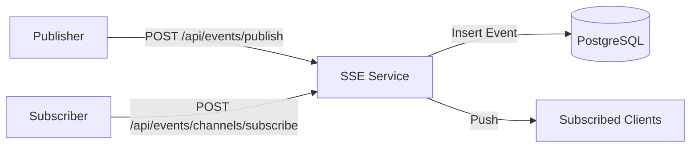

# Real-Time SSE Notification System

A lightweight, scalable real-time notification system built using Server-Sent Events (SSE) and Node.js.

## Tech Stack
- **Backend:** Node.js, Express
- **Real-time:** Server-Sent Events (SSE)
- **Database:** PostgreSQL (with event persistence)
- **Containerization:** Docker, Docker Compose

## Project Structure
```text
.
├── src/
│   ├── routes/      # API endpoints
│   ├── services/    # Business logic (SSE Manager)
│   ├── utils/       # Utility functions (Logger)
│   └── db.js        # Database connection
├── seeds/           # SQL scripts for DB initialization
├── Dockerfile       # Application container config
├── docker-compose.yml # Service orchestration
└── submission.json  # Evaluation config
```


A highly reliable, production-grade Server-Sent Events (SSE) notification system built with Node.js, PostgreSQL, and Docker. This system features event persistence, real-time streaming, heartbeats, and a robust event replay mechanism for handling disconnections.

## 🚀 Overview

In modern web applications, real-time updates are essential. While WebSockets are powerful, SSE offers a simpler, standardized protocol for unidirectional server-to-client data pushing over standard HTTP. This project implements a full lifecycle for SSE connections, including:

- **Reliability**: All events are persisted in PostgreSQL.
- **Replay**: Missed events are automatically replayed upon reconnection using the `Last-Event-ID` header.
- **Efficiency**: Indexed database lookups and optimized in-memory connection management.
- **Stability**: Integrated heartbeats to prevent connection timeouts by proxies or load balancers.

## 🏗️ Architecture



## 🛠️ Features

- **Standardized SSE**: Correct implementation of `text/event-stream` with `id`, `event`, and `data` fields.
- **Event Replay**: Seamlessly recover missed notifications after temporary network failures.
- **Health Management**: Docker healthchecks and service dependencies ensure the system is ready before accepting traffic.
- **Pagination**: Paginated history API for exploring past notifications.
- **Clean API**: Intuitive RESTful endpoints for channel and subscription management.

## 🏁 Getting Started

### Prerequisites

- Docker
- Docker Compose

### Quick Start

1. Clone the repository.
2. Build and start the services:
   ```bash
   docker-compose up --build
   ```
3. The API will be accessible at `http://localhost:8080`.

## ⚙️ Configuration

The application uses environment variables for configuration. See `.env.example` for the required variables:

- `DATABASE_URL`: Connection string for PostgreSQL.
- `PORT`: The port the server will listen on (default 8080).


## 🧪 Verification & Testing

### 1. Subscribe to a Channel
Create a subscription for a user:
```bash
curl -X POST http://localhost:8080/api/events/channels/subscribe \
-H "Content-Type: application/json" \
-d '{"userId": 1, "channel": "test-channel"}'
```

### 2. Connect to the SSE Stream
Open a terminal and listen for events (requires `curl` with `--no-buffer`):
```bash
curl -N --no-buffer "http://localhost:8080/api/events/stream?userId=1&channels=test-channel"
```

### 3. Publish an Event
In another terminal, publish a message:
```bash
curl -X POST http://localhost:8080/api/events/publish \
-H "Content-Type: application/json" \
-d '{
  "channel": "test-channel",
  "eventType": "SYSTEM_NOTIFICATION",
  "payload": {"message": "Hello from the server!", "priority": "high"}
}'
```
*Observe the event appearing immediately in the stream terminal.*

### 4. Test Event Replay
1. Publish an event and note its ID.
2. Disconnect the stream.
3. Publish another event.
4. Reconnect with the `Last-Event-ID` header:
   ```bash
   curl -N -H "Last-Event-ID: <LAST_ID>" "http://localhost:8080/api/events/stream?userId=1&channels=test-channel"
   ```
*The missed event will be replayed immediately.*

## 📖 API Reference

| Endpoint | Method | Description |
| :--- | :--- | :--- |
| `/api/events/publish` | `POST` | Publish an event to a channel |
| `/api/events/channels/subscribe` | `POST` | Subscribe user to a channel |
| `/api/events/stream` | `GET` | Main SSE streaming endpoint |
| `/api/events/history` | `GET` | Paginated event history |
| `/api/events/active-connections` | `GET` | Get current active client count |

---
*Developed as a demonstration of robust real-time system architecture.*
